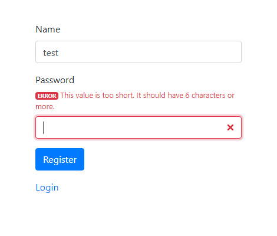
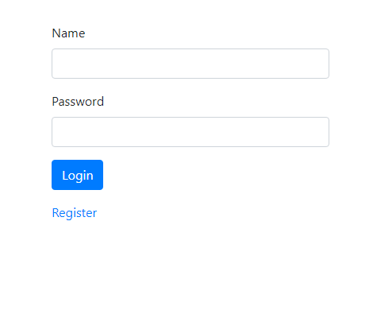

# ToDo App

Basic Todo app written in symfony using MariaDb for saving tasks. Also implemented registration and loging in.

### Table of contents
 - [Installation](#Installation)  
 - [Usage example](#Usage-example)  
 - [Tasks to do...](#Tasks-to-do)  
 - [Meta](#Meta)  
 - [Contributing](#Contributing)  

## Installation

**To run you need:**
- [Composer](https://getcomposer.org)
- MariaDB (I used one from [XAMPP](https://www.apachefriends.org/pl/index.html))

**Steps to run:**
1. clone or download
2. go to directory where you cloned/downloaded
3. run ```composer install```
4. run your MariaDB
5. run ```cp .env.example .env```
6. run ```php bin\console server:run```
7. run ```php bin\console doctrine:database:create```
8. run ```php bin\console doctrine:migrations:migrate```
9. go to [default server listening address](http://127.0.0.1:8000)
10. ***have fun!*** :+1:

## Usage-example
Registering new User  
  

Validating credentials  
  

Loging in  
  

Checking session  
  

Adding and deleting tasks!  
  

## Tasks-to-do
- [x] Registering user
- [x] Login in user
- [x] Displaying tasks
- [x] Readme.md
- [ ] Change endpoints according to REST API
- [ ] Logout for user
- [ ] History for tasks
- [ ] Improve UI/UX
- [ ] Unit tests

## Meta

Krzysztof Nowak – krzysztofn1993@gmail.com

Distributed under the MIT license. See [MIT License](https://choosealicense.com/licenses/mit/) for more information.

[https://github.com/krzysztofn1993](https://github.com/krzysztofn1993)

## Contributing

1. Fork it (<https://github.com/krzysztofn1993/ToDoApp/fork>)
2. Create your feature branch (`git checkout -b feature/fooBar`)
3. Commit your changes (`git commit -am 'Add some fooBar'`)
4. Push to the branch (`git push origin feature/fooBar`)
5. Create a new Pull Request
